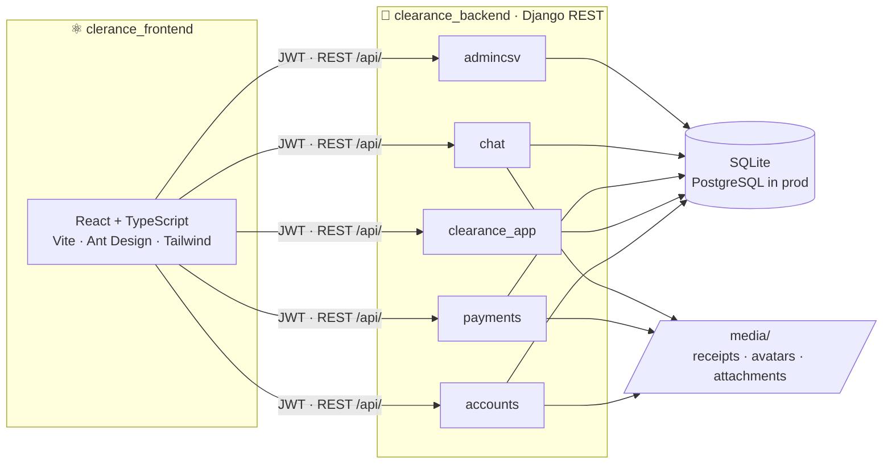
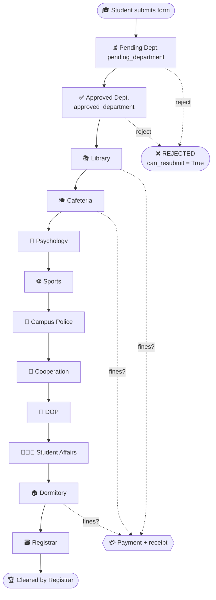
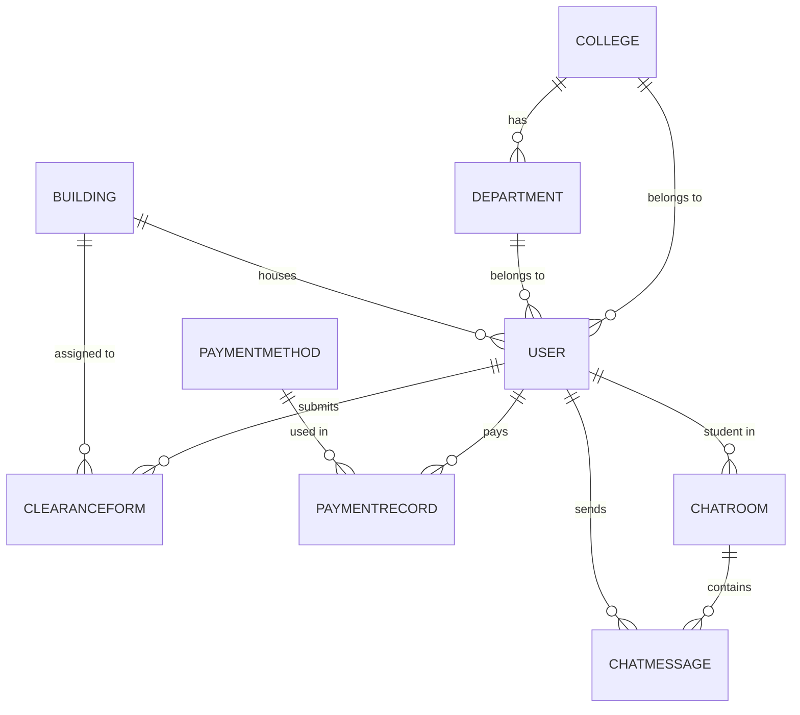

<div align="center">


# 🎓 University Clearance System

### Paperless graduation clearance for **Mekdela Amba University (MAU)**

*Apply · Track · Pay · Chat · Get Cleared, all online.*

<br/>


<br/>

[✨ Features](#-features) &nbsp;•&nbsp;
[🚀 Quick Start](#-getting-started) &nbsp;•&nbsp;
[🔄 Workflow](#-clearance-workflow) &nbsp;•&nbsp;
[📡 API](#-api-reference) &nbsp;•&nbsp;
[🛠️ Help](#-troubleshooting) &nbsp;•&nbsp;
[🤝 Contribute](#-contributing)

</div>

---

> ### 💡 In one sentence
> Students apply for graduation clearance, and **12 departments** (Library, Cafeteria, Dormitory, Registrar and more) approve or reject each stage in real time, with **live chat**, **payment verification**, **cost-sharing contracts** and an **admin CSV student registry** built in.

---

## 📌 Table of Contents

- [🧭 Overview](#-overview)
- [✨ Features](#-features)
- [🧱 Tech Stack](#-tech-stack)
- [🏗️ Architecture](#️-architecture)
- [📁 Project Structure](#-project-structure)
- [🎭 User Roles](#-user-roles)
- [🔄 Clearance Workflow](#-clearance-workflow)
- [🚀 Getting Started](#-getting-started)
- [🔑 Environment Variables](#-environment-variables)
- [📡 API Reference](#-api-reference)
- [🔐 Default Logins](#-default-logins)
- [🗄️ Database Schema](#️-database-schema)
- [🛠️ Troubleshooting](#️-troubleshooting)
- [🗺️ Roadmap](#️-roadmap)
- [🤝 Contributing](#-contributing)
- [📄 License](#-license)

---

## 🧭 Overview

The **University Clearance System (UCS)** digitizes the graduation clearance process at Mekdela Amba University.
Instead of walking from office to office collecting physical signatures, everything happens online:

| Step | | What happens |
|:---:|:---:|---|
| **1** | 📝 | The **student** fills out a clearance form. |
| **2** | ✅ | Each **staff department** reviews the student's record and approves or rejects. |
| **3** | 💬 | The student gets **live status updates** and can chat with each staff member. |
| **4** | 💳 | If there are fines or dues (e.g. an overdue library book), the student pays via **Telebirr / CBE / Awash / BOA** and uploads the receipt. |
| **5** | 🏆 | Once all departments approve, the **Registrar** issues the final clearance certificate. |

> **Approval chain:**
> `Dept. Head` → `Library` → `Cafeteria` → `Psychology` → `Sports` → `Campus Police` → `Cooperation` → `DOP` → `Student Affairs` → `Dormitory` → `Registrar`

---

## ✨ Features

<table>
<tr>
<td width="33%" valign="top">

### 🎓 Student
- 🔐 Register and log in with student ID (validated against the university's CSV registry)
- 📝 Submit a graduation clearance form
- 📊 Real-time progress tracking across all departments
- 💬 Live chat with each staff department
- 💳 Pay library / cafeteria / dormitory fines online and upload receipts
- 📄 View and print the cost-sharing promissory contract (Form CS-04)
- 🏆 Download the final clearance certificate once fully cleared

</td>
<td width="33%" valign="top">

### 🧑‍💼 Staff
*(12 departments)*
- 📋 Department-specific dashboard with pending student forms
- ✅ Approve or reject with notes
- 💰 Verify student payments and mark fines as cleared
- 💬 Chat with students
- 📈 Statistics per department

</td>
<td width="33%" valign="top">

### 🛡️ Admin
- 👥 Full user management (create staff accounts, change roles)
- 📥 Upload the valid-student CSV (source of truth for verification)
- 📊 CSV statistics dashboard (registration rate, active students)
- 🗂️ Manage colleges, departments and buildings
- ⚙️ Manage payment methods

</td>
</tr>
</table>

### ⚙️ System

| | Feature | Details |
|:-:|---|---|
| 🔐 | **JWT authentication** | Secure, stateless login with SimpleJWT |
| 🎭 | **Role-based permissions** | 13 distinct roles |
| 📎 | **File uploads** | Profile pictures, payment receipts, chat attachments |
| 🌍 | **CORS-enabled** | Ready for the React frontend |
| 🎨 | **Fully responsive UI** | Desktop, tablet and mobile |
| 🌐 | **Bilingual** | English + Amharic |

---

## 🧱 Tech Stack

<table>
<tr>
<td valign="top" width="50%">

### 🐍 Backend

| Technology | Version | Purpose |
|---|:---:|---|
| Python | 3.12+ | Runtime |
| Django | 6.1.2 | Web framework |
| Django REST Framework | 3.18.3 | API layer |
| djangorestframework-simplejwt | 5.5.1 | JWT auth |
| django-cors-headers | 4.9.0 | CORS |
| django-filter | 26.2 | Query filtering |
| Pillow | 12.3.0 | Image handling |
| python-decouple | 3.8 | Env variables |
| SQLite | 3 | Dev database |

</td>
<td valign="top" width="50%">

### ⚛️ Frontend

| Technology | Purpose |
|---|---|
| React 18 | UI |
| TypeScript | Type safety |
| Vite | Build tool |
| React Router DOM | Routing |
| Ant Design (antd) | UI components |
| Lucide React | Icons |
| Recharts | Charts |
| TailwindCSS | Utility styles |
| Bun / npm | Package manager |

</td>
</tr>
</table>

---

## 🏗️ Architecture



---

## 📁 Project Structure

```
university-clearance-system/
│
├── clearance_backend/      # 🐍 Django REST API
├── clerance_frontend/      # ⚛️ React + TypeScript app
├── .gitignore              # Root ignore file
└── README.md               # This file
```

<details open>
<summary><b>🐍 Backend, <code>clearance_backend/</code></b></summary>

```
clearance_backend/
│
├── config/                            # Django project settings
│   ├── __init__.py
│   ├── asgi.py
│   ├── settings.py
│   ├── urls.py
│   └── wsgi.py
│
├── accounts/                          # Users, auth, colleges, depts, buildings
│   ├── migrations/
│   │   ├── __init__.py
│   │   └── 0001_initial.py
│   ├── __init__.py
│   ├── admin.py
│   ├── apps.py
│   ├── models.py
│   ├── permissions.py
│   ├── serializers.py
│   ├── tests.py
│   ├── urls.py
│   └── views.py
│
├── clearance_app/                     # Clearance forms & workflow
│   ├── migrations/
│   │   ├── __init__.py
│   │   └── 0001_initial.py
│   ├── __init__.py
│   ├── admin.py
│   ├── apps.py
│   ├── models.py
│   ├── serializers.py
│   ├── tests.py
│   ├── urls.py
│   └── views.py
│
├── payments/                          # Payment methods, records, dues
│   ├── migrations/
│   │   ├── __init__.py
│   │   └── 0001_initial.py
│   ├── __init__.py
│   ├── admin.py
│   ├── apps.py
│   ├── models.py
│   ├── serializers.py
│   ├── tests.py
│   ├── urls.py
│   └── views.py
│
├── chat/                              # Chat rooms & messages
│   ├── migrations/
│   │   ├── __init__.py
│   │   └── 0001_initial.py
│   ├── __init__.py
│   ├── admin.py
│   ├── apps.py
│   ├── models.py
│   ├── serializers.py
│   ├── tests.py
│   ├── urls.py
│   └── views.py
│
├── admincsv/                          # Valid students CSV registry
│   ├── migrations/
│   │   ├── __init__.py
│   │   └── 0001_initial.py
│   ├── management/
│   │   ├── __init__.py
│   │   └── commands/
│   │       ├── __init__.py
│   │       └── seed_data.py           # Seeds demo data
│   ├── __init__.py
│   ├── admin.py
│   ├── apps.py
│   ├── models.py
│   ├── serializers.py
│   ├── tests.py
│   ├── urls.py
│   └── views.py
│
├── media/                             # Uploaded files (gitignored)
├── venv/                              # Virtual environment (gitignored)
├── db.sqlite3                         # SQLite DB (gitignored)
├── manage.py
├── requirements.txt
├── .env                               # Secrets (gitignored)
└── .env.example
```

</details>

<details open>
<summary><b>⚛️ Frontend, <code>clerance_frontend/</code></b></summary>

```
clerance_frontend/
│
├── public/
│   ├── favicon.svg
│   ├── icons.svg
│   └── mau_logo.png
│
├── src/
│   ├── assets/                        # Images, fonts, static files
│   │
│   ├── components/
│   │   ├── Authen/                    # Authentication pages
│   │   │   ├── AdminLogin.tsx
│   │   │   ├── AuthPage.tsx
│   │   │   ├── ForgotPasswordPage.tsx
│   │   │   ├── LoginPage.tsx
│   │   │   ├── Navbar.tsx
│   │   │   ├── RegisterPage.tsx
│   │   │   ├── ResetPasswordPage.tsx
│   │   │   └── VerifyPage.tsx
│   │   │
│   │   ├── Certificate/               # Certificates
│   │   │   ├── ClearanceCertificate.tsx
│   │   │   └── GraduationCertificate.tsx
│   │   │
│   │   ├── Chat/                      # Chat & AI chat
│   │   │   ├── AIChatWidget.tsx
│   │   │   ├── ChatButton.tsx
│   │   │   ├── ChatRoom.tsx
│   │   │   └── ChatSystem.tsx
│   │   │
│   │   ├── Common/                    # Shared widgets
│   │   │   └── StarryBackground.tsx
│   │   │
│   │   ├── Dashboard/                 # Role dashboards
│   │   │   └── StudentDashboard.tsx
│   │   │
│   │   ├── Footer/
│   │   │   ├── Footer.css
│   │   │   └── Footer.tsx
│   │   │
│   │   ├── Forms/                     # Clearance forms
│   │   │   └── ClearanceForm.tsx
│   │   │
│   │   ├── Header/
│   │   │   ├── Header.css
│   │   │   ├── Header.tsx
│   │   │   └── Notification.tsx
│   │   │
│   │   ├── Pages/                     # All department pages
│   │   │   ├── About.tsx
│   │   │   ├── AdminDashboard.tsx
│   │   │   ├── CafeteriaPage.tsx
│   │   │   ├── CampusPolicePage.tsx
│   │   │   ├── ChangePassword.tsx
│   │   │   ├── CooperationPage.tsx
│   │   │   ├── DepartmentHeadPage.tsx
│   │   │   ├── DeveloperPage.tsx
│   │   │   ├── DOPCoordinatorPage.tsx
│   │   │   ├── DormitoryPage.tsx
│   │   │   ├── IntroSliderPage.tsx
│   │   │   ├── LearnMore.tsx
│   │   │   ├── LibrarianPage.tsx
│   │   │   ├── MaintenancePage.tsx
│   │   │   ├── OfficePage.tsx
│   │   │   └── ProfilePage.tsx
│   │   │
│   │   ├── Payments/                  # Payment UIs
│   │   │   ├── StaffPaymentPage.tsx
│   │   │   └── StudentPaymentPage.tsx
│   │   │
│   │   ├── Student/                   # Student-specific widgets
│   │   │   ├── CostSharingContractSection.tsx
│   │   │   ├── DigitalID.tsx
│   │   │   ├── DisputeResolution.tsx
│   │   │   ├── DocumentCenter.tsx
│   │   │   ├── ExitSurvey.tsx
│   │   │   └── OfficeLocator.tsx
│   │   │
│   │   └── ErrorBoundary.tsx
│   │
│   ├── context/
│   │   └── LanguageContext.tsx
│   │
│   ├── utils/
│   │   ├── api.ts                     # API client (JWT)
│   │   └── mockData.ts                # (legacy seed data, not used)
│   │
│   ├── App.tsx
│   ├── index.css
│   ├── main.tsx
│   └── types.ts                       # Shared TypeScript interfaces
│
├── node_modules/                      # (gitignored)
├── bun.lock
├── index.html
├── metadata.json
├── package.json
├── tsconfig.json
├── vite.config.ts
├── .env                               # VITE_API_BASE_URL (gitignored)
├── .env.example
└── .gitignore
```

</details>

---

## 🎭 User Roles

| # | Role | Code | Responsibility |
|:-:|---|---|---|
| 1 | 🎓 Student | `student` | Applies for clearance |
| 2 | 🏛️ Department Head | `departmenthead` | Approves academic records |
| 3 | 📚 Librarian | `librarian` | Clears book loans / fines |
| 4 | 🍽️ Cafeteria | `cafeteria` | Clears meal tickets |
| 5 | 🧠 Psychology | `psychology` | Counseling clearance |
| 6 | ⚽ Sport Master | `sportmaster` | Returns sports equipment |
| 7 | 👮 Campus Police | `campuspolice` | Security check |
| 8 | 🤝 Cooperation & Sharing | `cooperationsharing` | Cost-sharing contract |
| 9 | 🎯 DOP Coordinator | `dopcordinator` | Degree program verification |
| 10 | 🧑‍🤝‍🧑 Student Affairs | `studentaffairs` | Residence & conduct |
| 11 | 🏠 Dormitory | `dormitory` | Room inspection & keys |
| 12 | 🗃️ Registrar | `registrar` | Final certificate issuance |
| 13 | 🛡️ Admin | `admin` | System management |

---

## 🔄 Clearance Workflow



| Rule | Description |
|---|---|
| ❌ **Rejection** | At **any** stage a form can be rejected; the student may resubmit (`can_resubmit=True`). |
| 💳 **Payments** | Library, Cafeteria and Dormitory may require payment before approval. |
| 🔖 **Status codes** | Stored in `FormStatus` (see `clearance_app/models.py`). |

---

## 🚀 Getting Started

### 📋 Prerequisites

| Requirement | Version |
|---|---|
| 🐍 Python | 3.12 or newer |
| 🟢 Node.js **or** Bun | 18+ / 1.0+ |
| 🔧 Git | any recent version |
| 🐘 PostgreSQL | *(optional, for production)* |

### 🐍 Backend Setup (Django + DRF)

```bash
# 1. Enter backend folder
cd clearance_backend

# 2. Create virtual environment
python3 -m venv venv

# 3. Activate it
source venv/bin/activate          # Linux / macOS
# venv\Scripts\activate           # Windows

# 4. Install dependencies
pip install -r requirements.txt

# 5. Copy environment template
cp .env.example .env
# Edit .env if needed (defaults work for local dev)

# 6. Apply migrations
python manage.py makemigrations
python manage.py migrate

# 7. Seed demo data (creates colleges, students, staff)
python manage.py seed_data

# 8. Run the server
python manage.py runserver
```

✅ Backend live at **http://localhost:8000**

### ⚛️ Frontend Setup (React + TypeScript)

```bash
# 1. In a new terminal, enter frontend folder
cd clerance_frontend

# 2. Install dependencies
bun install
# or: npm install

# 3. Create environment file
cp .env.example .env
# Make sure it contains:
#   VITE_API_BASE_URL=http://localhost:8000/api/

# 4. Start the dev server
bun run dev
# or: npm run dev
```

✅ Frontend live at **http://localhost:5173**

---

## 🔑 Environment Variables

<details>
<summary><b>🐍 Backend, <code>clearance_backend/.env</code></b></summary>

```env
SECRET_KEY=change-me-to-a-long-random-string
DEBUG=True
ALLOWED_HOSTS=localhost,127.0.0.1
CORS_ALLOWED_ORIGINS=http://localhost:5173,http://localhost:3000
```

</details>

<details>
<summary><b>⚛️ Frontend, <code>clerance_frontend/.env</code></b></summary>

```env
VITE_API_BASE_URL=http://localhost:8000/api/
```

</details>

> ⚠️ **Never commit `.env` files.** Only `.env.example` should be tracked.

---

## 📡 API Reference

All endpoints are prefixed with `/api/`. Protected endpoints require the header:
`Authorization: Bearer <access_token>`

<details open>
<summary><b>🔐 Auth & Users, <code>accounts</code></b></summary>

| Method | Endpoint | Auth | Description |
|:---:|---|:---:|---|
| `GET` | `/public/colleges` | 🌐 Public | List colleges |
| `GET` | `/public/departments` | 🌐 Public | List departments |
| `GET` | `/buildings` | 🌐 Public | List dormitory buildings |
| `POST` | `/verify-student-by-id` | 🌐 Public | Check student ID against CSV |
| `POST` | `/register` | 🌐 Public | Register new student |
| `POST` | `/login` | 🌐 Public | Login → JWT token |
| `GET` | `/me` | 🔒 JWT | Current user info |

</details>

<details>
<summary><b>📝 Clearance, <code>clearance_app</code></b></summary>

| Method | Endpoint | Auth | Description |
|:---:|---|:---:|---|
| `GET` | `/student/dashboard` | 🎓 Student | Forms + notifications |
| `GET` | `/student/forms` | 🎓 Student | List my forms |
| `POST` | `/forms/submit` | 🎓 Student | Submit new clearance form |
| `GET` | `/forms` | 🔒 Any role | List forms (role-scoped) |
| `POST` | `/{role}/action/{id}` | 🧑‍💼 Staff | Approve or reject a form |

</details>

<details>
<summary><b>💳 Payments, <code>payments</code></b></summary>

| Method | Endpoint | Auth | Description |
|:---:|---|:---:|---|
| `GET` | `/payment/methods` | 🌐 Public | Active payment methods |
| `POST` | `/payment/submit` | 🎓 Student | Upload receipt |
| `GET` | `/payment/pending` | 🧑‍💼 Staff | Pending verifications |
| `GET` | `/payment/verified` | 🧑‍💼 Staff | Verified payments |
| `GET` | `/dues` | 🔒 Any | Fines / dues for current user |

</details>

<details>
<summary><b>💬 Chat, <code>chat</code></b></summary>

| Method | Endpoint | Auth | Description |
|:---:|---|:---:|---|
| `GET` | `/chat/rooms` | 🔒 JWT | My chat rooms |
| `GET` | `/chat/messages/{room_id}` | 🔒 JWT | Messages in a room |
| `POST` | `/chat/send` | 🔒 JWT | Send message |

</details>

<details>
<summary><b>🗂️ Admin CSV, <code>admincsv</code></b></summary>

| Method | Endpoint | Auth | Description |
|:---:|---|:---:|---|
| `GET` / `POST` | `/admin/valid-students` | 🛡️ Admin | List / bulk-upload valid students |
| `GET` | `/admin/csv-statistics` | 🛡️ Admin | Registration stats |

</details>

---

## 🔐 Default Logins

After running `python manage.py seed_data`, you get these accounts:

| Role | Username | Password |
|---|---|---|
| 🎓 Student | `AAA1234` | `student123` |
| 🏛️ Department Head | `depthead_se` | `staff123` |
| 📚 Librarian | `librarian_main` | `staff123` |
| 🍽️ Cafeteria | `cafeteria_main` | `staff123` |
| 🧠 Psychology | `psychology_main` | `staff123` |
| ⚽ Sport Master | `sportmaster_main` | `staff123` |
| 👮 Campus Police | `campuspolice_main` | `staff123` |
| 🤝 Cooperation | `cooperation_main` | `staff123` |
| 🎯 DOP Coordinator | `dop_main` | `staff123` |
| 🧑‍🤝‍🧑 Student Affairs | `studentaffairs_main` | `staff123` |
| 🏠 Dormitory | `dormitory_main` | `staff123` |
| 🗃️ Registrar | `registrar_main` | `staff123` |
| 🛡️ Admin | `admin_mau` | `staff123` |

Extra student IDs for testing: `STU001`, `STU002`, `STU003`, `STU004`, `2024CS001`.

> 🚨 **Change these passwords before deploying to production!**

---

## 🗄️ Database Schema



<details>
<summary><b>📖 Model details</b></summary>

### `accounts`
- **User** (custom `AbstractUser`): `role`, `id_number`, `phone`, `college`, `department`, `building`, `profile_picture`
- **College**: `name`
- **Department**: `college (FK)`, `name`
- **Building**: `name`, `code`

### `admincsv`
- **ValidStudent**: `first_name`, `last_name`, `id_number`, `email`, `college`, `department`, `year_of_admission`, `status`, `is_registered`

### `clearance_app`
- **ClearanceForm**: student info + 12 department notes + `status` + `building`

### `payments`
- **PaymentMethod**: `name`, `account_name`, `account_number`, `bank_name`, `phone_number`, `instructions`, `is_active`
- **PaymentRecord**: `transaction_id`, `student (FK)`, `student_number`, `amount`, `payment_method (FK)`, `receipt`, `status`, `verified_by`
- **DueRecord**: `student_id`, `book_title`, `room_number`, `amount`, `due_date`, `status`, `payment_status`

### `chat`
- **ChatRoom**: `student (FK)`, `student_number`, `staff_role`, `staff_user (FK)`, `last_message`
- **ChatMessage**: `room (FK)`, `sender (FK)`, `content`, `message_type`, files, `is_read`

</details>

---

## 🛠️ Troubleshooting

<details>
<summary><code>ModuleNotFoundError: No module named 'decouple'</code></summary>

Activate your venv, then:

```bash
pip install python-decouple
```

</details>

<details>
<summary><code>which python</code> points to Anaconda instead of venv</summary>

Recreate the venv using system Python:

```bash
deactivate
rm -rf venv
/usr/bin/python3 -m venv venv
source venv/bin/activate
pip install -r requirements.txt
```

</details>

<details>
<summary><code>models.E006: The field 'student_id' clashes with the field 'student'</code></summary>

Django reserves `student_id` for the FK column. We renamed our CharField to `student_number` in `PaymentRecord` and `ChatRoom`. The serializers re-expose it as `student_id`, so the frontend API stays unchanged.

</details>

<details>
<summary><code>Vite: Failed to resolve import "react-router-dom"</code></summary>

```bash
cd clerance_frontend
bun add react-router-dom antd @ant-design/icons
```

</details>

<details>
<summary>🌐 CORS errors in the browser</summary>

Make sure `CORS_ALLOWED_ORIGINS` in `clearance_backend/.env` includes your frontend URL (e.g. `http://localhost:5173`), then restart the backend.

</details>

<details>
<summary><code>python manage.py seed_data</code> → "Unknown command"</summary>

The management folder is missing:

```bash
mkdir -p admincsv/management/commands
touch admincsv/management/__init__.py
touch admincsv/management/commands/__init__.py
# then add seed_data.py
```

</details>

<details>
<summary>🔌 Port already in use</summary>

```bash
python manage.py runserver 8001        # backend on 8001
bun run dev -- --port 5174             # frontend on 5174
```

Remember to update `VITE_API_BASE_URL` and `CORS_ALLOWED_ORIGINS` if you change ports.

</details>

---

## 🗺️ Roadmap

- [x] JWT authentication and role-based permissions
- [x] 12-department clearance workflow
- [x] Payment receipt upload and verification
- [x] Live student ↔ staff chat
- [x] CSV-based student registry
- [x] Clearance and graduation certificates
- [x] English + Amharic support
- [ ] PostgreSQL production configuration
- [ ] Email / SMS notifications
- [ ] Docker and CI/CD pipeline
- [ ] Automated test suite

---

## 🤝 Contributing

Contributions are welcome! 🎉

1. 🍴 **Fork** the repo
2. 🌿 **Create** a feature branch: `git checkout -b feature/my-feature`
3. 💾 **Commit**: `git commit -m "feat: add my feature"`
4. 📤 **Push**: `git push origin feature/my-feature`
5. 🔀 **Open** a Pull Request

### Commit message convention

| Prefix | Use for |
|---|---|
| `feat:` | ✨ New feature |
| `fix:` | 🐛 Bug fix |
| `chore:` | 🔧 Tooling / config |
| `docs:` | 📚 Documentation |
| `refactor:` | ♻️ Code refactor |

---

## 📄 License

This project is licensed under the **MIT License**. See [`LICENSE`](LICENSE) for details.

---

## 👨‍💻 Authors

**Yonas Sahile**, Full-stack developer

[](https://github.com/yonassahile)

## 🙏 Acknowledgements

- 🏫 Mekdela Amba University, Department of Software Engineering
- 🇪🇹 Federal Democratic Republic of Ethiopia, Ministry of Education (Cost Sharing Proclamation No. 650/2009)
- ❤️ The Django & React open-source communities

---

<div align="center">

**Made with ❤️ for Mekdela Amba University**

⭐ *If you find this project useful, please give it a star!* ⭐

</div>
