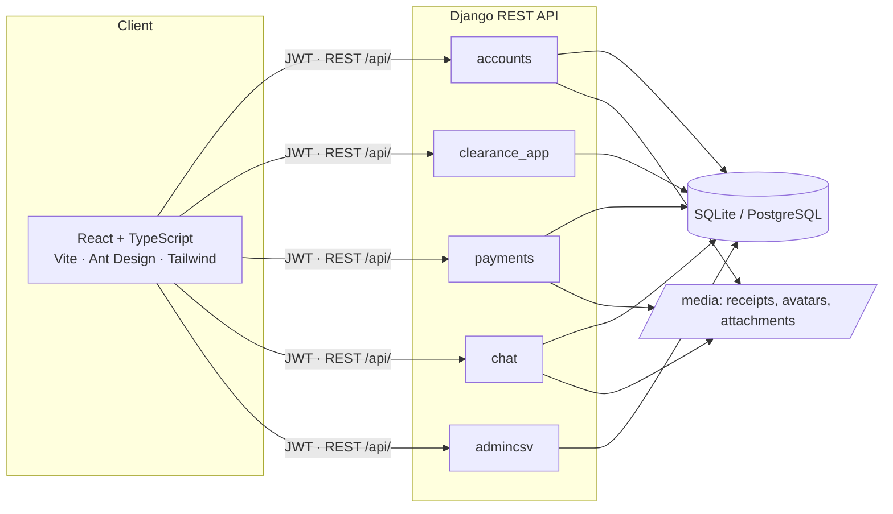
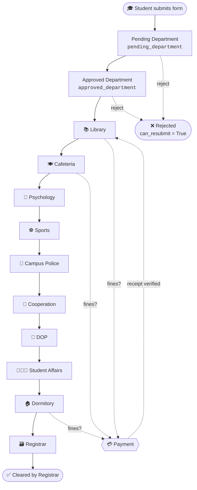
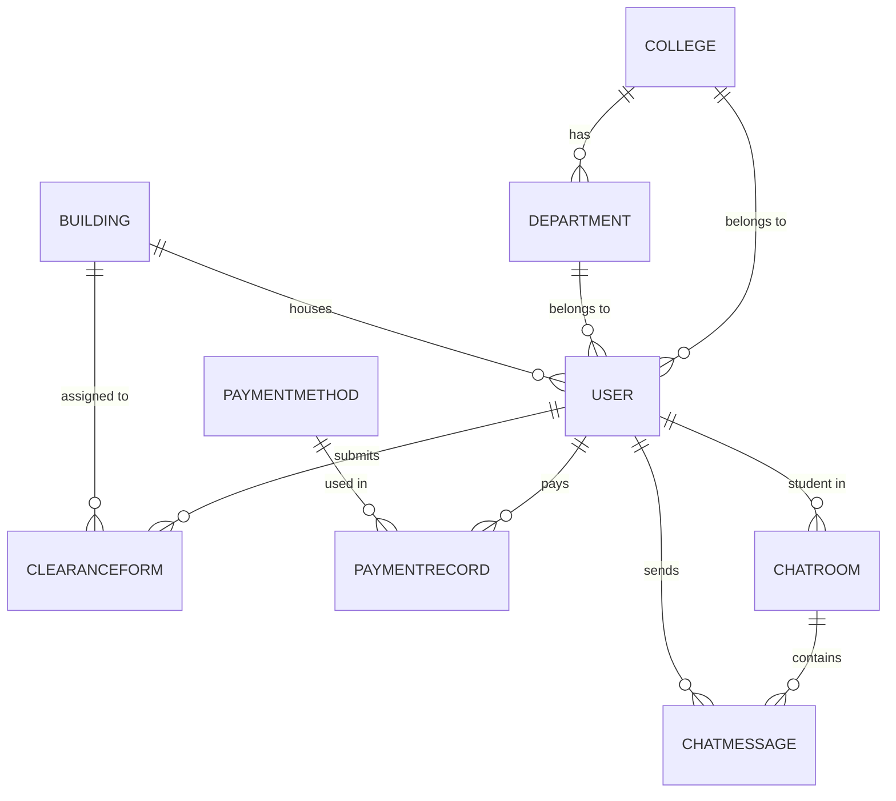

<div align="center">

# 🎓 University Clearance System

### Digital graduation clearance for **Mekdela Amba University (MAU)**

*No more walking from office to office collecting signatures. Apply, track, pay, chat and get cleared, all online.*

<br/>


[Features](#-features) •
[Quick Start](#-quick-start) •
[Workflow](#-clearance-workflow) •
[API](#-api-reference) •
[Troubleshooting](#-troubleshooting) •
[Contributing](#-contributing)

</div>

---

## 📌 Table of Contents

- [Overview](#-overview)
- [Features](#-features)
- [Tech Stack](#-tech-stack)
- [Architecture](#-architecture)
- [Project Structure](#-project-structure)
- [User Roles](#-user-roles)
- [Clearance Workflow](#-clearance-workflow)
- [Quick Start](#-quick-start)
- [Environment Variables](#-environment-variables)
- [API Reference](#-api-reference)
- [Default Logins](#-default-logins)
- [Database Schema](#-database-schema)
- [Screenshots](#-screenshots)
- [Troubleshooting](#-troubleshooting)
- [Roadmap](#-roadmap)
- [Contributing](#-contributing)
- [License](#-license)
- [Author](#-author)
- [Acknowledgements](#-acknowledgements)

---

## 🧭 Overview

The **University Clearance System (UCS)** digitizes the graduation clearance process at Mekdela Amba University. Previously, students had to physically visit every office to collect signatures. With UCS the whole process happens online:

| Step | What happens |
|:---:|---|
| **1** | The **student** registers (validated against the university's CSV registry) and submits a clearance form. |
| **2** | Each **department** reviews the student's record in sequence and approves or rejects it. |
| **3** | The student receives **live status updates** and can **chat** with the staff member handling the case. |
| **4** | If fines or dues exist (e.g. an overdue library book), the student pays via **Telebirr / CBE / Awash / BOA** and uploads the receipt. |
| **5** | Once every department approves, the **Registrar** issues the final clearance certificate. |

> **Approval chain:** Department Head → Library → Cafeteria → Psychology → Sports → Campus Police → Cooperation → DOP → Student Affairs → Dormitory → Registrar

---

## ✨ Features

<table>
<tr>
<td width="33%" valign="top">

### 🎓 Student
- 🔐 Register and log in with a student ID validated against the CSV registry
- 📝 Submit a graduation clearance form
- 📊 Real-time progress tracking across all departments
- 💬 Live chat with each department
- 💳 Pay fines online and upload receipts
- 📄 View and print the cost-sharing promissory contract (Form CS-04)
- 🏆 Download the final clearance certificate

</td>
<td width="33%" valign="top">

### 🧑‍💼 Staff
- 📋 Department-specific dashboard with pending forms
- ✅ Approve or reject with notes
- 💰 Verify payments and mark fines as cleared
- 💬 Chat with students
- 📈 Per-department statistics

</td>
<td width="33%" valign="top">

### 🛡️ Admin
- 👥 Full user management (create staff, change roles)
- 📥 Upload the valid-student CSV (source of truth)
- 📊 CSV statistics (registration rate, active students)
- 🗂️ Manage colleges, departments and buildings
- ⚙️ Manage payment methods

</td>
</tr>
</table>

### ⚙️ System-wide

| | |
|---|---|
| 🔐 **JWT authentication** | Secure, stateless auth via SimpleJWT |
| 🎭 **Role-based permissions** | 13 distinct roles |
| 📎 **File uploads** | Profile pictures, payment receipts, chat attachments |
| 🌍 **CORS-enabled** | Ready for the React frontend |
| 🎨 **Responsive UI** | Works on desktop, tablet and mobile |
| 🌐 **Bilingual** | English and Amharic |

---

## 🧱 Tech Stack

<table>
<tr>
<td valign="top" width="50%">

### Backend

| Technology | Version | Purpose |
|---|---|---|
| Python | 3.12+ | Runtime |
| Django | 6.1.2 | Web framework |
| Django REST Framework | 3.18.3 | API layer |
| djangorestframework-simplejwt | 5.5.1 | JWT auth |
| django-cors-headers | 4.9.0 | CORS |
| django-filter | 26.2 | Query filtering |
| Pillow | 12.3.0 | Image handling |
| python-decouple | 3.8 | Env variables |
| SQLite | 3 | Dev database |

</td>
<td valign="top" width="50%">

### Frontend

| Technology | Purpose |
|---|---|
| React 18 | UI library |
| TypeScript | Type safety |
| Vite | Build tool |
| React Router DOM | Routing |
| Ant Design | UI components |
| Lucide React | Icons |
| Recharts | Charts |
| TailwindCSS | Utility styles |
| Bun / npm | Package manager |

</td>
</tr>
</table>

---

## 🏗️ Architecture



---

## 📁 Project Structure

<details>
<summary><b>Click to expand the full tree</b></summary>

```
university-clearance-system/
│
├── clearance_backend/              # Django REST API
│   ├── accounts/                   # Users, auth, colleges, departments, buildings
│   ├── clearance_app/              # Clearance forms & workflow
│   ├── payments/                   # Payment methods, records, dues
│   ├── chat/                       # Chat rooms & messages
│   ├── admincsv/                   # Valid students CSV registry
│   │   └── management/commands/
│   │       └── seed_data.py        # Seeds demo data
│   ├── config/                     # Django project settings (settings, urls, wsgi, asgi)
│   ├── media/                      # Uploaded files (gitignored)
│   ├── venv/                       # Virtual environment (gitignored)
│   ├── manage.py
│   ├── requirements.txt
│   ├── .env                        # Secrets (gitignored)
│   └── .env.example
│
├── clerance_frontend/              # React + TypeScript app
│   ├── src/
│   │   ├── components/
│   │   │   ├── Authen/             # Login, Register, Verify, ForgotPassword
│   │   │   ├── Certificates/       # Clearance & graduation certificates
│   │   │   ├── Chat/               # Chat UI
│   │   │   ├── Common/             # Shared components
│   │   │   ├── Dashboard/          # Role dashboards
│   │   │   ├── Footer/
│   │   │   ├── Forms/              # Clearance forms
│   │   │   ├── Header/
│   │   │   ├── Pages/              # Library, Cafeteria, Dormitory, ...
│   │   │   ├── Payments/
│   │   │   └── Student/
│   │   ├── context/                # React contexts (language, auth)
│   │   ├── utils/
│   │   │   ├── api.ts              # API client (JWT)
│   │   │   └── mockData.ts         # Legacy, unused after backend integration
│   │   ├── types.ts                # Shared TypeScript interfaces
│   │   ├── App.tsx
│   │   └── main.tsx
│   ├── public/
│   ├── index.html
│   ├── package.json
│   ├── tsconfig.json
│   ├── vite.config.ts
│   ├── .env                        # VITE_API_BASE_URL
│   └── .env.example
│
├── .gitignore
└── README.md
```

> 📝 The frontend folder is named `clerance_frontend` (sic). Use that exact name in commands.

</details>

Each backend app follows the same layout: `models.py`, `serializers.py`, `views.py`, `urls.py`, `admin.py` (plus `permissions.py` in `accounts`).

---

## 🎭 User Roles

| # | Role | Code | Responsibility |
|:-:|---|---|---|
| 1 | 🎓 Student | `student` | Applies for clearance |
| 2 | 🏛️ Department Head | `departmenthead` | Approves academic records |
| 3 | 📚 Librarian | `librarian` | Clears book loans and fines |
| 4 | 🍽️ Cafeteria | `cafeteria` | Clears meal tickets |
| 5 | 🧠 Psychology | `psychology` | Counseling clearance |
| 6 | ⚽ Sport Master | `sportmaster` | Returns sports equipment |
| 7 | 👮 Campus Police | `campuspolice` | Security check |
| 8 | 🤝 Cooperation & Sharing | `cooperationsharing` | Cost-sharing contract |
| 9 | 🎯 DOP Coordinator | `dopcordinator` | Degree program verification |
| 10 | 🧑‍🤝‍🧑 Student Affairs | `studentaffairs` | Residence and conduct |
| 11 | 🏠 Dormitory | `dormitory` | Room inspection and keys |
| 12 | 🗃️ Registrar | `registrar` | Final certificate issuance |
| 13 | 🛡️ Admin | `admin` | System management |

---

## 🔄 Clearance Workflow



- ❌ **At any stage** a form can be rejected, and the student may resubmit (`can_resubmit=True`).
- 💳 **Library, Cafeteria and Dormitory** may require payment before approval.
- 🔖 Status codes are stored in `FormStatus` (see `clearance_app/models.py`).

---

## 🚀 Quick Start

### Prerequisites

| Requirement | Version |
|---|---|
| Python | 3.12+ |
| Node.js **or** Bun | 18+ / 1.0+ |
| Git | any recent |
| PostgreSQL | *optional, for production* |

### 🐍 1. Backend (Django + DRF)

```bash
# Enter the backend folder
cd clearance_backend

# Create and activate a virtual environment
python3 -m venv venv
source venv/bin/activate          # Linux / macOS
# venv\Scripts\activate           # Windows

# Install dependencies
pip install -r requirements.txt

# Configure environment (defaults work for local dev)
cp .env.example .env

# Apply migrations
python manage.py makemigrations
python manage.py migrate

# Seed demo data (colleges, students, staff)
python manage.py seed_data

# Run the server
python manage.py runserver
```

✅ Backend running at **http://localhost:8000**

### ⚛️ 2. Frontend (React + TypeScript)

```bash
# In a new terminal
cd clerance_frontend

# Install dependencies
bun install            # or: npm install

# Configure environment
cp .env.example .env
# Make sure it contains: VITE_API_BASE_URL=http://localhost:8000/api/

# Start the dev server
bun run dev            # or: npm run dev
```

✅ Frontend running at **http://localhost:5173**

---

## 🔑 Environment Variables

<details>
<summary><b>Backend — <code>clearance_backend/.env</code></b></summary>

```env
SECRET_KEY=change-me-to-a-long-random-string
DEBUG=True
ALLOWED_HOSTS=localhost,127.0.0.1
CORS_ALLOWED_ORIGINS=http://localhost:5173,http://localhost:3000
```

</details>

<details>
<summary><b>Frontend — <code>clerance_frontend/.env</code></b></summary>

```env
VITE_API_BASE_URL=http://localhost:8000/api/
```

</details>

> ⚠️ **Never commit `.env` files.** Only `.env.example` should be tracked.

---

## 📡 API Reference

All endpoints are prefixed with `/api/`. Authenticated endpoints expect the header `Authorization: Bearer <access_token>`.

<details open>
<summary><b>🔐 Auth & Users — <code>accounts</code></b></summary>

| Method | Endpoint | Auth | Description |
|:---:|---|:---:|---|
| `GET` | `/public/colleges` | Public | List colleges |
| `GET` | `/public/departments` | Public | List departments |
| `GET` | `/buildings` | Public | List dormitory buildings |
| `POST` | `/verify-student-by-id` | Public | Check student ID against the CSV |
| `POST` | `/register` | Public | Register a new student |
| `POST` | `/login` | Public | Login and receive a JWT |
| `GET` | `/me` | JWT | Current user info |

</details>

<details>
<summary><b>📝 Clearance — <code>clearance_app</code></b></summary>

| Method | Endpoint | Auth | Description |
|:---:|---|:---:|---|
| `GET` | `/student/dashboard` | Student | Forms and notifications |
| `GET` | `/student/forms` | Student | List my forms |
| `POST` | `/forms/submit` | Student | Submit a new clearance form |
| `GET` | `/forms` | Any role | List forms (role-scoped) |
| `POST` | `/{role}/action/{id}` | Staff | Approve or reject a form |

</details>

<details>
<summary><b>💳 Payments — <code>payments</code></b></summary>

| Method | Endpoint | Auth | Description |
|:---:|---|:---:|---|
| `GET` | `/payment/methods` | Public | Active payment methods |
| `POST` | `/payment/submit` | Student | Upload receipt |
| `GET` | `/payment/pending` | Staff | Pending verifications |
| `GET` | `/payment/verified` | Staff | Verified payments |
| `GET` | `/dues` | Any | Fines and dues for the current user |

</details>

<details>
<summary><b>💬 Chat — <code>chat</code></b></summary>

| Method | Endpoint | Auth | Description |
|:---:|---|:---:|---|
| `GET` | `/chat/rooms` | JWT | My chat rooms |
| `GET` | `/chat/messages/{room_id}` | JWT | Messages in a room |
| `POST` | `/chat/send` | JWT | Send a message |

</details>

<details>
<summary><b>🗂️ Admin CSV — <code>admincsv</code></b></summary>

| Method | Endpoint | Auth | Description |
|:---:|---|:---:|---|
| `GET` / `POST` | `/admin/valid-students` | Admin | List / bulk-upload valid students |
| `GET` | `/admin/csv-statistics` | Admin | Registration statistics |

</details>

---

## 🔑 Default Logins

After running `python manage.py seed_data`, these demo accounts are available:

| Role | Username | Password |
|---|---|---|
| 🎓 Student | `AAA1234` | `student123` |
| 🏛️ Department Head | `depthead_se` | `staff123` |
| 📚 Librarian | `librarian_main` | `staff123` |
| 🍽️ Cafeteria | `cafeteria_main` | `staff123` |
| 🧠 Psychology | `psychology_main` | `staff123` |
| ⚽ Sport Master | `sportmaster_main` | `staff123` |
| 👮 Campus Police | `campuspolice_main` | `staff123` |
| 🤝 Cooperation | `cooperation_main` | `staff123` |
| 🎯 DOP Coordinator | `dop_main` | `staff123` |
| 🧑‍🤝‍🧑 Student Affairs | `studentaffairs_main` | `staff123` |
| 🏠 Dormitory | `dormitory_main` | `staff123` |
| 🗃️ Registrar | `registrar_main` | `staff123` |
| 🛡️ Admin | `admin_mau` | `staff123` |

Extra student IDs for testing: `STU001`, `STU002`, `STU003`, `STU004`, `2024CS001`.

> 🚨 **Security notice:** these credentials are for local development only. **Change or remove them before deploying to production.**

---

## 🗄️ Database Schema



<details>
<summary><b>Model details</b></summary>

### `accounts`
- **User** (custom `AbstractUser`): `role`, `id_number`, `phone`, `college`, `department`, `building`, `profile_picture`
- **College**: `name`
- **Department**: `college (FK)`, `name`
- **Building**: `name`, `code`

### `admincsv`
- **ValidStudent**: `first_name`, `last_name`, `id_number`, `email`, `college`, `department`, `year_of_admission`, `status`, `is_registered`

### `clearance_app`
- **ClearanceForm**: student info, 12 department notes, `status`, `building`

### `payments`
- **PaymentMethod**: `name`, `account_name`, `account_number`, `bank_name`, `phone_number`, `instructions`, `is_active`
- **PaymentRecord**: `transaction_id`, `student (FK)`, `student_number`, `amount`, `payment_method (FK)`, `receipt`, `status`, `verified_by`
- **DueRecord**: `student_id`, `book_title`, `room_number`, `amount`, `due_date`, `status`, `payment_status`

### `chat`
- **ChatRoom**: `student (FK)`, `student_number`, `staff_role`, `staff_user (FK)`, `last_message`
- **ChatMessage**: `room (FK)`, `sender (FK)`, `content`, `message_type`, files, `is_read`

</details>

---

## 🖼️ Screenshots

> Add screenshots here after your first deployment, e.g. `docs/screenshots/login.png`.

| Page | Preview |
|---|---|
| Login | _screenshot_ |
| Student Dashboard | _screenshot_ |
| Department Head View | _screenshot_ |
| Payments | _screenshot_ |
| Chat | _screenshot_ |

---

## 🛠️ Troubleshooting

<details>
<summary><code>ModuleNotFoundError: No module named 'decouple'</code></summary>

Activate your virtual environment, then:

```bash
pip install python-decouple
```

</details>

<details>
<summary><code>which python</code> points to Anaconda instead of the venv</summary>

Recreate the venv with system Python:

```bash
deactivate
rm -rf venv
/usr/bin/python3 -m venv venv
source venv/bin/activate
pip install -r requirements.txt
```

</details>

<details>
<summary><code>models.E006: The field 'student_id' clashes with the field 'student'</code></summary>

Django reserves `student_id` for the foreign key. The model field was renamed to `student_number`; make sure you have the updated `models.py`. The serializer re-exposes it as `student_id`, so the frontend API is unchanged.

</details>

<details>
<summary><code>Vite: Failed to resolve import "react-router-dom"</code></summary>

```bash
cd clerance_frontend
bun add react-router-dom antd @ant-design/icons
```

</details>

<details>
<summary>CORS errors in the browser</summary>

Make sure `CORS_ALLOWED_ORIGINS` in `clearance_backend/.env` includes your frontend URL (e.g. `http://localhost:5173`), then restart the backend.

</details>

<details>
<summary><code>python manage.py seed_data</code> → "Unknown command"</summary>

The management folder is missing:

```bash
mkdir -p admincsv/management/commands
touch admincsv/management/__init__.py
touch admincsv/management/commands/__init__.py
# then add seed_data.py
```

</details>

<details>
<summary>Port already in use</summary>

```bash
python manage.py runserver 8001        # backend on 8001
bun run dev -- --port 5174             # frontend on 5174
```

Remember to update `VITE_API_BASE_URL` and `CORS_ALLOWED_ORIGINS` if you change ports.

</details>

---

## 🗺️ Roadmap

- [x] JWT authentication and role-based permissions
- [x] Multi-department clearance workflow
- [x] Payment receipt upload and verification
- [x] Student ↔ staff live chat
- [x] CSV-based student registry
- [x] English + Amharic support
- [ ] PostgreSQL production configuration
- [ ] Email / SMS notifications
- [ ] Docker and CI/CD setup
- [ ] Automated test suite
- [ ] Audit log for approvals and rejections

---

## 🤝 Contributing

Contributions are welcome!

1. **Fork** the repository
2. **Create** a feature branch: `git checkout -b feature/my-feature`
3. **Commit** your changes: `git commit -m "feat: add my feature"`
4. **Push** the branch: `git push origin feature/my-feature`
5. **Open** a Pull Request

### Commit message convention

| Prefix | Use for |
|---|---|
| `feat:` | New feature |
| `fix:` | Bug fix |
| `chore:` | Tooling / config |
| `docs:` | Documentation |
| `refactor:` | Code refactor |

---

## 📄 License

Distributed under the **MIT License**. See [`LICENSE`](LICENSE) for details.

---

## 👨‍💻 Author

**Yonas Sahile**, Full-stack developer
[](https://github.com/yonassahile)

## 🙏 Acknowledgements

- Mekdela Amba University, Department of Software Engineering
- Federal Democratic Republic of Ethiopia, Ministry of Education (Cost Sharing Proclamation No. 650/2009)
- The Django and React open-source communities

---

<div align="center">

**Made with ❤️ for Mekdela Amba University**

⭐ If this project helps you, please consider giving it a star!

</div>
